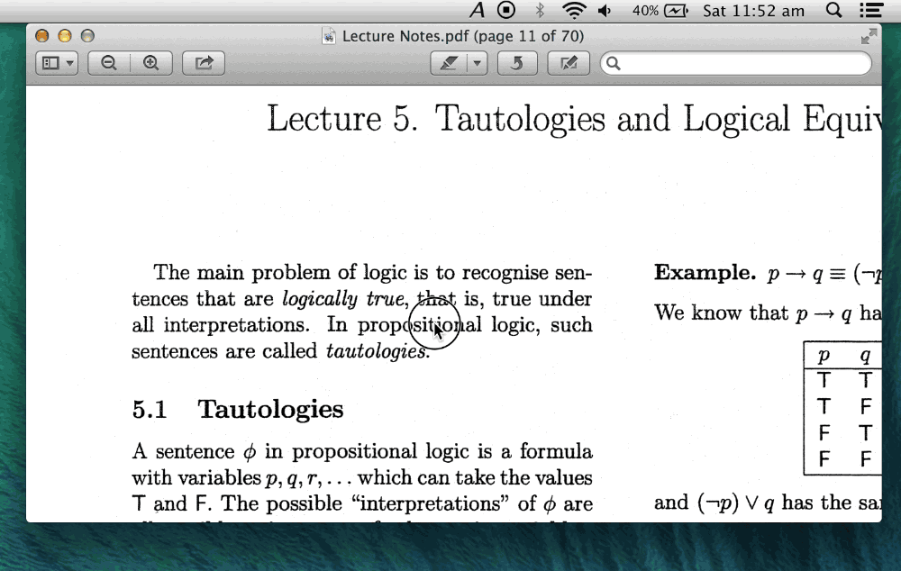
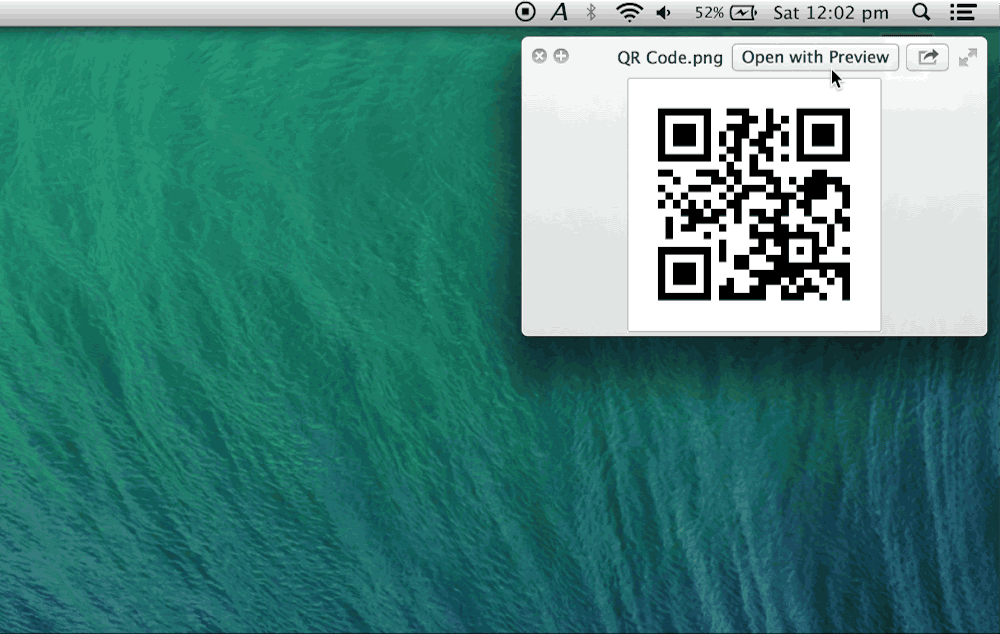

Aristocrat is simple utility that makes Optical Character Recognition and Barcode Decoding easy.

Select an area of your screen (which can be done through a system-wide hotkey) and Aristocrat works its magic.

It then either performs OCR on any selected text or decodes any of the following barcode types:

- EAN-8 and EAN-13
- Code 39
- Code 93
- Code 128
- ITF
- Codabar
- RSS-14
- QR Code
- Data Matrix
- Aztec
- PDF 417

The results can then easily be copied to your pasteboard or shared from the Aristocrat menu.

