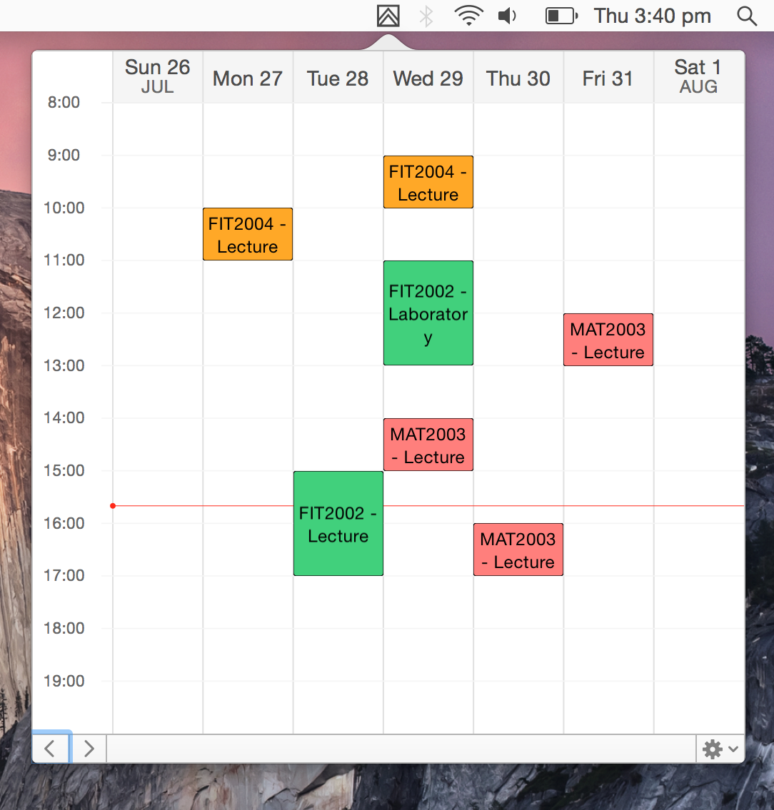

MonashTimetable is a simple open-source Mac application that puts your Monash University timetable in your menu bar. It automatically downloads and stores your timetable from the [my.monash portal](https://my.monash.edu.au), allowing you to have easy access to your classes whenever you're on your Mac.

Simply double-click on a class to view extended information like the unit title, location and duration.

MonashTimetable supports customizable unit colors so you're able to visually distinguish your classes. It also shows you the current time in the day and allows you to look at your upcoming weeks - only displaying classes that are running that week.

You can also optionally set it to launch at startup.

This application and its source code are not affiliated with Monash University.
